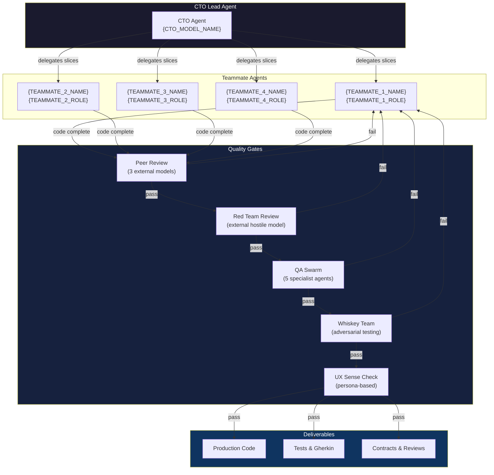
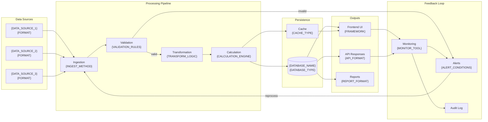
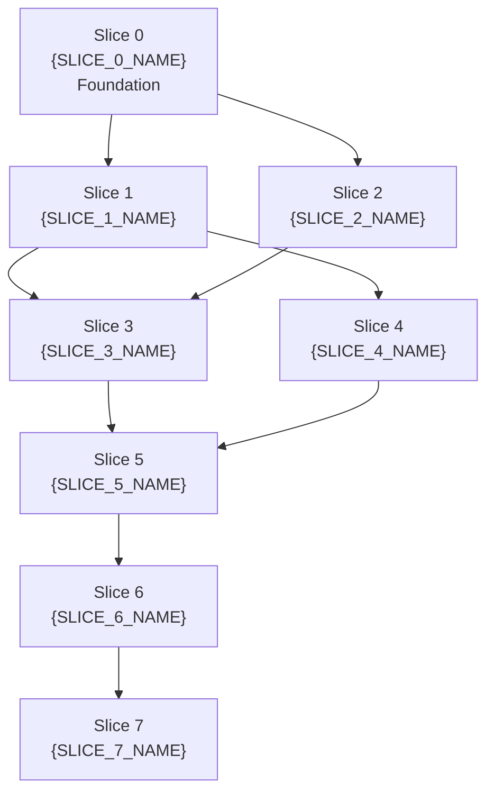
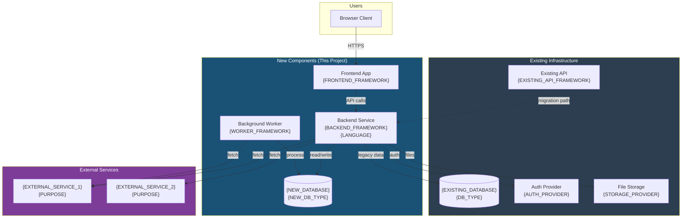
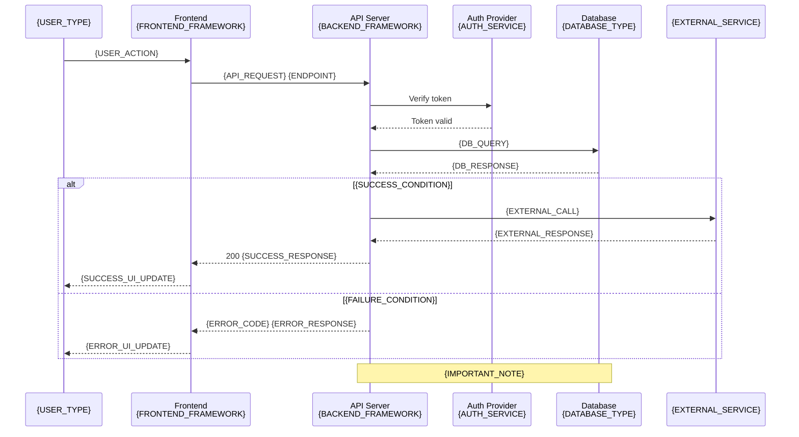

# Mermaid Diagram Templates

> Copy and adapt these diagrams for your project. Replace all `{PLACEHOLDER}` values with project-specific names. These render natively in GitHub, GitLab, Notion, Obsidian, and most modern Markdown viewers.

---

## 1. Agent Architecture Diagram

> Shows the CTO lead agent, teammate agents, and quality gates in the build pipeline.



---

## 2. Data Flow / Feedback Loop Diagram

> Shows how data moves through the system and how feedback loops operate.



---

## 3. Slice Dependency Graph

> Shows the build order and dependencies between slices.



---

## 4. Infrastructure Diagram

> Shows existing infrastructure vs. new components being added.



---

## 5. Sequence Diagram

> Shows component interactions for a specific slice or feature. Create one per slice during Phase A preparation.



---

## 6. Entity-Relationship Diagram

> Shows all data entities and their relationships. High-level version created in Slice 0; focused per-slice versions created during each slice's Phase A.

```mermaid
erDiagram
    {ENTITY_1} ||--o{ {ENTITY_2} : "{RELATIONSHIP_VERB}"
    {ENTITY_1} {
        {TYPE} {FIELD_1} PK
        {TYPE} {FIELD_2}
        {TYPE} {FIELD_3}
        {TYPE} created_at
        {TYPE} updated_at
    }

    {ENTITY_2} ||--|{ {ENTITY_3} : "{RELATIONSHIP_VERB}"
    {ENTITY_2} {
        {TYPE} {FIELD_1} PK
        {TYPE} {ENTITY_1}_id FK
        {TYPE} {FIELD_2}
        {TYPE} status
        {TYPE} created_at
    }

    {ENTITY_3} {
        {TYPE} {FIELD_1} PK
        {TYPE} {ENTITY_2}_id FK
        {TYPE} {FIELD_2}
        {TYPE} {FIELD_3}
    }

    {ENTITY_4} }o--|| {ENTITY_1} : "{RELATIONSHIP_VERB}"
    {ENTITY_4} {
        {TYPE} {FIELD_1} PK
        {TYPE} {ENTITY_1}_id FK
        {TYPE} {FIELD_2}
    }
```

**Relationship notation:**
- `||--||` = one to one
- `||--o{` = one to zero-or-many
- `||--|{` = one to one-or-many
- `}o--||` = zero-or-many to one

---

## 7. State Machine Diagram (OPTIONAL)

> For complex workflows with defined states and transitions. **Optional/reference only** — include when your project has UI wizards, multi-step processes, retry logic, or other stateful workflows. Not required for every project.

```mermaid
stateDiagram-v2
    [*] --> {STATE_INITIAL}: {TRIGGER_EVENT}

    {STATE_INITIAL} --> {STATE_VALIDATING}: {ACTION_SUBMIT}
    {STATE_VALIDATING} --> {STATE_VALID}: validation passes
    {STATE_VALIDATING} --> {STATE_INVALID}: validation fails

    {STATE_INVALID} --> {STATE_INITIAL}: user corrects input

    {STATE_VALID} --> {STATE_PROCESSING}: {ACTION_PROCESS}
    {STATE_PROCESSING} --> {STATE_COMPLETE}: processing succeeds
    {STATE_PROCESSING} --> {STATE_ERROR}: processing fails

    {STATE_ERROR} --> {STATE_PROCESSING}: retry
    {STATE_ERROR} --> {STATE_FAILED}: max retries exceeded

    {STATE_COMPLETE} --> {STATE_REVIEWING}: {ACTION_REVIEW}
    {STATE_REVIEWING} --> {STATE_APPROVED}: reviewer approves
    {STATE_REVIEWING} --> {STATE_REJECTED}: reviewer rejects

    {STATE_REJECTED} --> {STATE_INITIAL}: restart workflow

    {STATE_APPROVED} --> [*]
    {STATE_FAILED} --> [*]

    note right of {STATE_PROCESSING}
        {PROCESSING_NOTE}
        Timeout: {TIMEOUT_DURATION}
        Max retries: {MAX_RETRIES}
    end note

    note right of {STATE_REVIEWING}
        {REVIEW_NOTE}
        Required approvers: {APPROVER_COUNT}
    end note
```

---

## Slice 0 Diagram Protocol

**During Slice 0 (Phase A.5),** the Architect creates these high-level overview diagrams for user review:

| # | Diagram | Template | What It Covers |
|---|---------|----------|---------------|
| 1 | System Architecture | Template 1 (Agent Architecture) or Template 4 (Infrastructure) | ALL components, boundaries, new vs existing |
| 2 | Data Model (ER) | Template 6 (ER Diagram) | ALL entities, relationships, cardinality |
| 3 | User Flow | Template 2 (Data Flow) | Full user journey, decision points, paths |
| 4 | Slice Dependency Graph | Template 3 (Slice Dependency) | Build order, slice dependencies |

The user reviews and approves the big picture. No detailed per-slice diagrams at this stage.

**During Slices 1+ (Phase A),** the Architect creates per-slice detailed diagrams:

| Diagram | Template | What It Covers |
|---------|----------|---------------|
| Sequence diagram(s) | Template 5 (Sequence) | This slice's component interactions, API calls, auth flows |
| Focused ER diagram | Template 6 (ER) | Just the entities this slice touches or modifies |

Per-slice diagrams are created as part of preparation, NOT as a blocking user gate. The CTO presents them if useful, but they do not halt the build.

**Saved to:**
- Slice 0 diagrams: `slices/architecture-diagrams.md`
- Per-slice diagrams: `slices/slice-N-diagrams.md`

---

## Usage Notes

1. **Rendering**: Paste these into any Markdown file. They render automatically on GitHub, GitLab, Obsidian, and in VS Code with the Markdown Preview Mermaid extension.

2. **Customization**: Replace all `{PLACEHOLDER}` values. Remove sections that do not apply. Add nodes and connections as needed.

3. **Slice Progress Tracking**: In the Slice Dependency Graph, uncomment and update the `class` lines to visually track which slices are done, active, blocked, or pending.

4. **Colors**: The `style` and `classDef` lines control colors. Adjust to match your project or team preferences.

5. **Live Editor**: Use [mermaid.live](https://mermaid.live) to preview and debug diagrams before committing.

6. **Diagram Lifecycle**: High-level diagrams are created once in Slice 0 and updated in Phase I (Documentation Update) if a later slice changes the architecture. Per-slice diagrams are created fresh for each slice during Phase A.

7. **State Diagrams**: Template 7 (State Machine) is optional. Include only when your project has stateful workflows (wizards, retry logic, multi-step processes). Not required by default.
